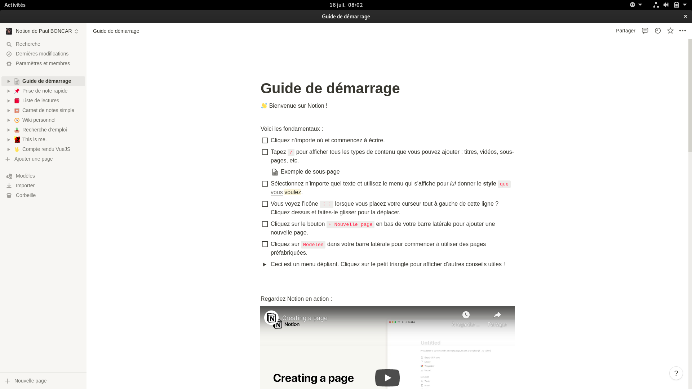

# Notion Linux

Notion but on Linux. (ElectronJS)

## Get Started

Go to the [release page](https://github.com/n0ct3ri4/NotionLinux/releases) and download the `latest.zip` file.

Inside the folder, there is an app called `notionlinux`. This is the executable.
